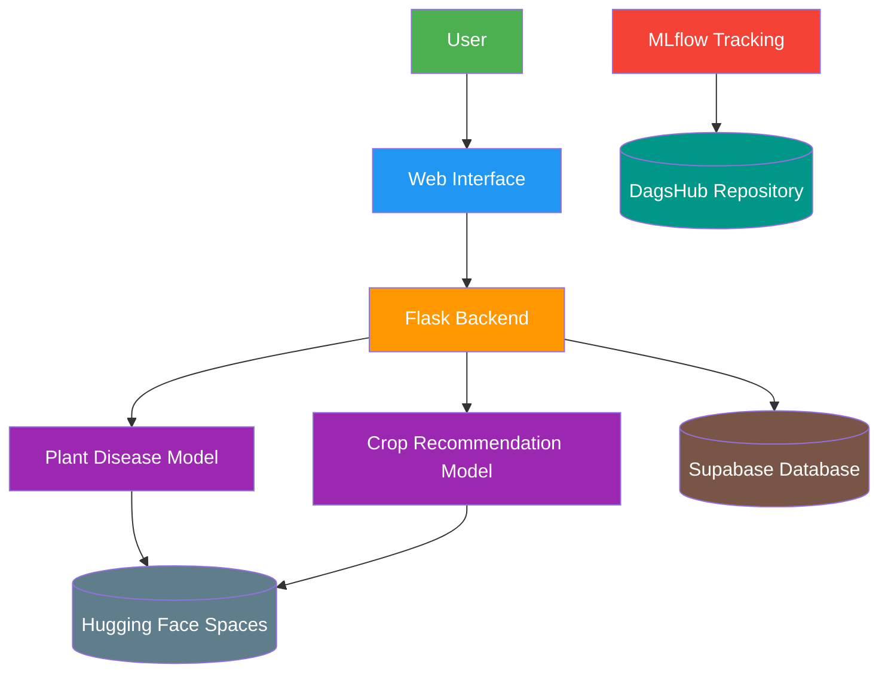

# 🌿 **Flora – Smart Farming Companion**  

### *AI-Powered Plant Disease Detection & Crop Recommendation System for Sustainable Agriculture*

---

## 📖 Overview

**Flora** is an intelligent agricultural assistant designed to empower **farmers, home gardeners, and agricultural students** with AI-driven insights. By combining deep learning and machine learning, Flora helps users:

- 🌿 **Detect plant diseases** from leaf images in real-time
- 🌾 **Recommend optimal crops** based on soil and climate conditions
- 📊 **Track farming data** for better decision-making

Our mission is to make agriculture more **accessible, efficient, and sustainable**—especially for those with limited expertise or resources.

---

## 🌐 Live Demos

| Platform | Description | Link |
|----------|-------------|------|
| **🌱 Plant Disease Detection** | Upload a leaf image and get instant diagnosis | [Hugging Face Space](https://huggingface.co/spaces/Mai-22/plant-disease-detection) |
| **🌾 Crop Recommendation** | Input soil/climate parameters for crop suggestions | [Hugging Face Space](https://huggingface.co/spaces/Mai-22/Crop-Recommendation-deployment) |
| **🚀 Web Application** | Full-stack application with user-friendly interface | [Vercel Deployment](https://flora-81nw.vercel.app/home) |

---

## 📊 Model Performance & Experiment Tracking

All experiments, model versions, and performance metrics are tracked using **MLflow** and hosted on **DagsHub**:

🔗 **Experiment Dashboard:** [https://dagshub.com/maimohamed201526/plant-disease-project](https://dagshub.com/maimohamed201526/plant-disease-project)

---

## 🗃️ Database & Infrastructure

- **Database:** [Supabase](https://supabase.com/dashboard/project/onnbpuqxtmdddbksfgrt)
- **Model Hosting:** Hugging Face Spaces
- **Frontend Hosting:** Vercel
- **Version Control:** Git & DagsHub

---

## 🎯 Key Features

### 🔍 Plant Disease Detection
- **Model:** EfficientNet-B0 fine-tuned on PlantVillage dataset
- **Classes:** 38 plant disease categories + healthy plants
- **Real-time Inference:** < 5 seconds per image
- **Confidence Scoring:** Transparent probability estimates

### 🌾 Crop Recommendation System
- **Input Parameters:** Nitrogen (N), Phosphorus (P), Potassium (K), temperature, humidity, pH, rainfall
- **Algorithm:** Ensemble methods (Random Forest, XGBoost)
- **Output:** Top crop recommendations with suitability scores

### 🛠️ Technical Features
- **Containerized Deployment** using Docker
- **RESTful API** for easy integration
- **Responsive Web Interface**
- **Experiment Tracking** with MLflow

---

## 📈 Models Performance

### Plant Disease Detection 
| Model | Accuracy | Precision | Recall | F1-Score |
|-------|----------|-----------|--------|----------|
| EfficientNet-B0 | 93.5% | 94.8% | 93.5% | 92.3% |
| ResNet-50 | 91.2% | 92.1% | 91.2% | 90.8% |
| VGG 16| 90.2% | 87.2% | 91.1% | 85.3% |

### Crop Recommendation
| Model | Accuracy | Macro F1 | Weighted F1 |
|-------|----------|----------|-------------|
| Random Forest | 99.2% | 0.992 | 0.992 |
| XGBoost | 99.1% | 0.991 | 0.991 |

---

## 📚 Dataset Information

### Plant Disease Detection
- **Source:** [PlantVillage Dataset on Kaggle](https://www.kaggle.com/datasets/abdallahalidev/plantvillage-dataset)
- **Size:** ~50,000 images
- **Classes:** 38 categories (14 crop species, multiple diseases + healthy)
- **Split:** 70% train, 15% validation, 15% test

### Crop Recommendation
- **Source:** [Crop Recommendation Dataset on Kaggle](https://www.kaggle.com/datasets/atharvaingle/crop-recommendation-dataset)
- **Size:** 2,200+ samples
- **Features:** 7 agricultural parameters
- **Crops:** 22 different crop types

---

## 🏗️ System Architecture


---

## 🔄 Machine Learning Pipeline

### Plant Disease Detection
1. **Data Collection** - PlantVillage dataset
2. **Preprocessing** - Image resizing, normalization, augmentation
3. **Model Training** - Transfer learning with EfficientNet-B0
4. **Validation** - freezing some layers
5. **Deployment** - Docker container on Hugging Face Spaces

### Crop Recommendation
1. **Data Analysis** - Exploratory data analysis and feature engineering
2. **Model Selection** - Comparison of multiple ML algorithms
3. **Training** - Ensemble method optimization
4. **API Development** - RESTful endpoint creation
5. **Integration** - Web application deployment

---

## 📁 Project Structure (Hugging Face Spaces)

```
📦 Plant Disease/
 ┣ 📜 app.py
 ┣ 📜 score.py
 ┣ 📜 requirements.txt
 ┣ 📜 Dockerfile
 ┣ 📜 categories.json
 ┣ 📜 best_efficientnet_b0.pth
 ┗ 📜 README.md
```
```
📦 Crop Recommendation/
 ┣ 📜 app.py
 ┣ 📜 score.py
 ┣ 📜 requirements.txt
 ┣ 📜 Dockerfile
 ┣ 📜 label_encoder.pkl
 ┣ 📜 best_model_XGBoost.pkl
 ┗ 📜 README.md
```

---

## 🚀 Quick Start

```bash
git clone <https://github.com/nhahub/NHA-046>
cd flora
pip install -r requirements.txt
python app.py
```
---

## ⚡ API Endpoints

### 🔍 1. Plant Disease Detection

**POST** `/predict_disease`

#### Request Body

```json
{
  "image": "<uploaded leaf image>"
}
```

#### Response 

```json
{
  "diagnosis": "status",
  "confidence": "0.95"
}
```

---

### 🌾 2. Crop Recommendation

**POST** `/recommend_crop`

#### Request Body

```json
{
  "N": 0,
  "P": 0,
  "K": 0,
  "temperature": 0,
  "humidity": 0,
  "ph": 0,
  "rainfall": 0
}
```

#### Response 

```json
{
  "recommended_crop": "CROP_NAME"
}
```

---

## 🎥 Demo Video

🎬 *Placeholder — Add video link here*

---

## 📦 Deployment

### 🐳 Using Docker

```bash
# Build image
docker build -t flora-app .

# Run container
docker run -p 7860:7860 flora-app
```
---

# 🛠️ Technology Stack (Recap)

| Category         | Technologies                   |
| ---------------- | ------------------------------ |
| Machine Learning | PyTorch, Scikit-learn, XGBoost |
| Backend          | FastAPI, Python                |
| Frontend         | React, Vercel                  |
| Deployment       | Hugging Face Spaces, Docker    |
| Data Tracking    | MLflow, DagsHub                |
| Database         | Supabase                       |
| Version Control  | Git, GitHub                    |

---

## 🌟 Impact & Use Cases

### 👨‍🌾 For Small-Scale Farmers

* Early disease detection to prevent crop loss
* Data-driven planting decisions for higher yields
* Reduced dependency on agricultural experts

### 🌱 For Home Gardeners

* Easy plant health monitoring through mobile photos
* Optimal crop selection for home gardens
* Educational resource for plant care

### 🎓 For Agricultural Students

* Practical AI application in agriculture
* Open-source learning resource
* Research foundation for agricultural technology

---

## 🔮 Future Enhancements

* Mobile application development
* Multi-language support for global accessibility
* Fertilizer recommendation system
* Soil quality assessment from images
* Weather integration for predictive analytics
* Community features for farmer knowledge sharing

---
